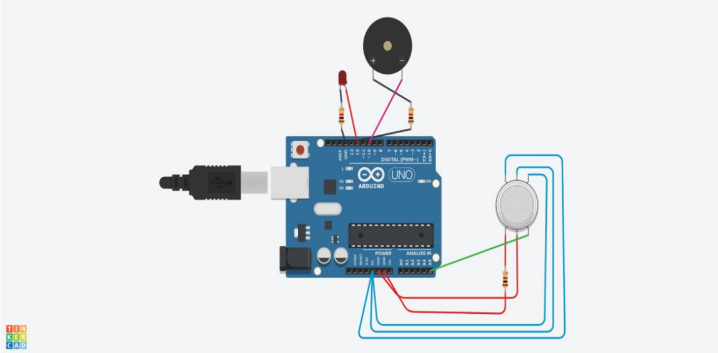

# Gas Leakage Detection System

## Overview
This project simulates a gas leakage detection system using Tinkercad, Arduino, a gas sensor (simulated using analog pin A5), a red LED, and a buzzer. The system monitors the sensor value and activates the alarm (LED and buzzer) when the value exceeds a predefined threshold.

## Hardware Components
* Arduino board
* Red LED
* Buzzer
* Gas sensor (simulated using analog pin A5)

## Software
* Arduino IDE
* Tinkercad

## Circuit Diagram

## Usage
1. Connect the hardware components as shown in the circuit diagram.
2. Upload the code to the Arduino board.
3. Open the serial monitor to view sensor values.
4. Simulate gas leakage by increasing the sensor value (e.g., by adjusting the simulated gas sensor in Tinkercad).
5. The system will activate the alarm (LED and buzzer) when the sensor value exceeds the threshold.

## Future Improvements
* Implement more sophisticated alarm mechanisms (e.g., SMS alerts, remote notifications).
* Calibrate the sensor threshold based on specific gas types and concentrations.
* Improve the alarm response time for faster detection.